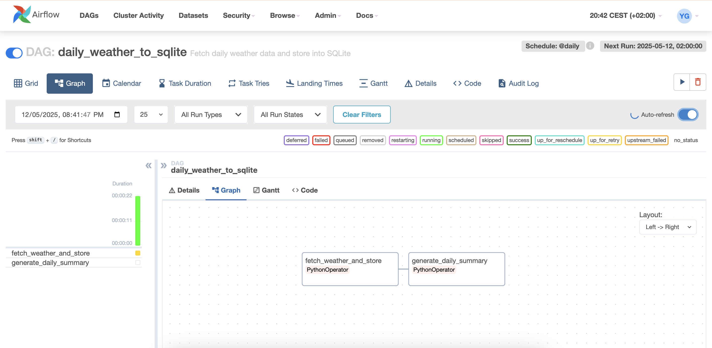
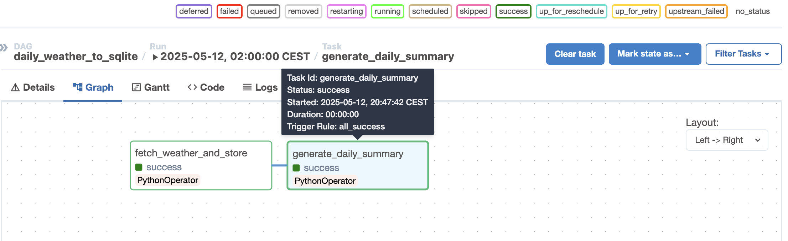
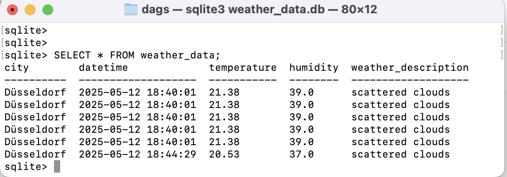

# 🌤️ Daily Weather Data Pipeline using Apache Airflow

## Overview

This project is a hands-on implementation of a simple **ETL pipeline using Apache Airflow**, designed to fetch **daily weather data** for Düsseldorf and store it in a **SQLite database**.

I created this project to build a simple but realistic pipeline and showcase it as part of my data engineering learning journey. 


## 📌 Objectives

- Learn and demonstrate Airflow DAGs and scheduling.
- Use OpenWeatherMap API to fetch real-time weather data.
- Store weather data in a structured format in SQLite.
- Generate daily summaries using SQL.
- Run and monitor everything via the Airflow UI.
- Easily extensible to use cloud storage or databases like BigQuery


## 🏗️ Tech Stack

- **Apache Airflow** (with Docker)
- **Python**
- **SQLite**
- **OpenWeatherMap API**
- **Docker Compose** (for setup)
- **VS Code / CLI for local development**


## 🛠️ Setup Instructions

### 1. Install Docker

### 2. Clone the Repository
Airflow was set up using the official Apache Airflow Docker Compose example.
```bash
git clone https://github.com/apache/airflow.git
```
Move into the Docker setup folder:
```bash
cd airflow/airflow-core/docs/howto/docker-compose
```

### 3. Setup docker-compose.yaml 

Set up 3 more folders in docker-compose using the below code 
```bash 
mkdir -p ./dags ./logs
```
dags/ → for your DAG Python files
logs/ → for storing Airflow logs

next execute the below code 
```bash 
echo -e "AIRFLOW_UID=$(id -u)\nAIRFLOW_GID=0" > .env
```
This .env file sets user permissions correctly for Docker.

I also have made a few modifications in the docker-compose.yaml file such as changing the image (apache/airflow:|version|) to (image: apache/airflow:2.8.1) and (command: api-server) to (command: webserver) and more. I have uploaded this in the current project repository

### 4. Directory Structure

Inside the airflow/airflow-core/docs/howto/docker-compose folder, upadte your DAG file and supporting files:

```bash
project-root/
├── dags/
│   ├── weather_pipeline.py         # The Airflow DAG that fetches and stores weather data
│   ├── weather_data.db             # SQLite database file where the weather data is stored
│
├── docker-compose.yaml             # Airflow Docker setup file (from official Airflow repo)
```

### 5. Weather API Setup

- Sign up at OpenWeatherMap = https://home.openweathermap.org/api_keys
- Get your API key
- Replace it in the weather_pipeline.py file: API_KEY = 'your_api_key_here'

### 6. Start Airflow via Docker

Ensure Docker Desktop is running, then execute:
```bash 
docker-compose up airflow-init
docker-compose up
```
Access the Airflow UI at: http://localhost:8080
(Default credentials: airflow / airflow)



### 7. DAG Overview
The main DAG file is:
.../dags/weather_pipeline.py
#### Tasks:
- fetch_weather_and_store: Fetches weather data and stores it in SQLite
- generate_daily_summary: Summarizes daily average temperature and humidity

### 8. How to Query the Data
Inspect the local SQLite database using Terminal 

```bash 
sqlite3 /path/to.../weather_data.db
sqlite> .headers
sqlite> .mode
sqlite> SELECT * FROM weather_data;
```

#### Sample Output
- Output 1 (Graph)


- Output 2 (From SQLLite)


## Dependencies

All dependencies are managed within the Airflow Docker containers, but here are the main Python libraries used:
requests, sqlite3, datetime, OS

## Future Improvements
- Integrate email alerts using Airflow EmailOperator
- Store weather summaries in a separate table
- Extend to Google BigQuery or AWS S3 for cloud storage
- Extend this idea to add task dependencies and retry policies
